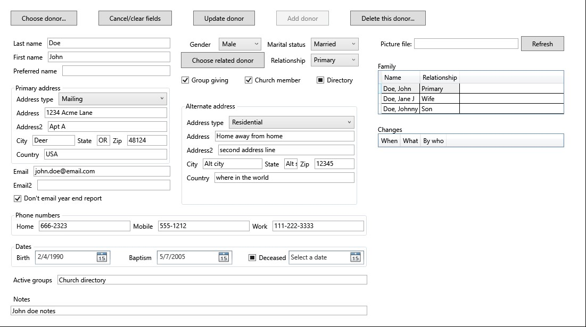
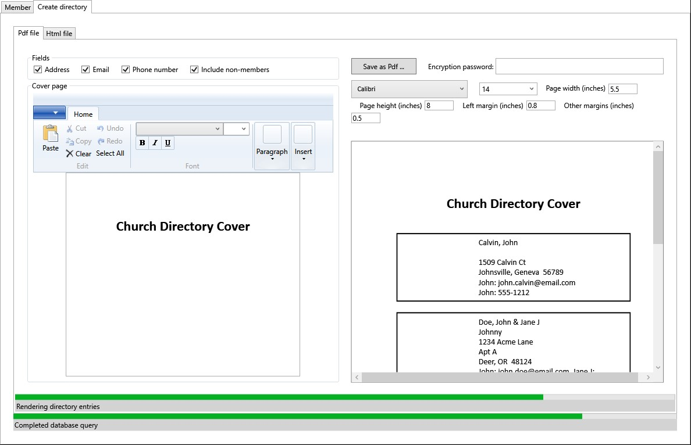
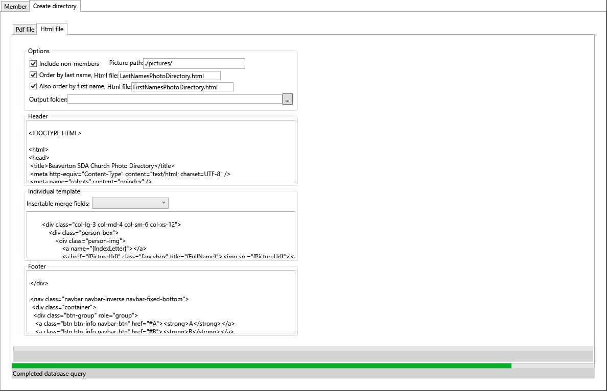

# Church member manager
## Overview
Windows (C#/WPF) desktop application for managing a church member database.

This is a companion application to the Donations software, sharing the same database's Donor table.
This application will allow updates and aditions to the Donor table but does not allow access of visibility to the donations.

## Projects
There is a single visual studio solution which contains seven projects.

* Donations.Lib - is a ClassLibrary that contains most of the code.
* Donations - is a small project that builds a desktop application that exposes the functionality from the lib.
* Donations.Test - unit tests
* Members - another desktop application that allows viewing and editing donors only.
* Donations installer - creates an msi and setup.exe which will install the Donation tracking software.
* Members installer - creates an msi and setup.exe which will install the Member management software.

## Log file
This application writes limited entries to a log file, but if an error or unexpected behavior is ever encountered, check the log.
Log files can be found in the following location:

%APPDATA%\Donation tracker

## Screen shots
Run the application Members.exe with the command line argument -screens which takes one parameter which is the relative or absolute path where the screenshots should be written.
The screenshots used in this help document are genrated with this feature of the application.

For example:

```
Members.exe -screens $(SolutionDir)Documentation\screens

or 

Members.exe -screens $(TargetDir)Help
```

## Application documentation
* [Main application](#The-main-application)
* [Database setup wizard](#Database-setup-wizard)

## The main application
The main application is called Members.exe.

* Member
* Directory
  * Pdf
  * Html
* About

### Member

#### Donor


This tab is where donor records are edited, or new donors added.

##### Edit donor
Click "Choose donor" or ctrl-d to select a donor to edit.


After making the needed changes, click "Update donor" or ctrl-u, and the fields will be cleared.

##### Add donor
Fill out the fields and then click "Add donor" or ctrl-a.

##### Required/optional fields
In general, name either address or email address would be required.
That would allow for a way to send the giving report to the donor.
The address type should be "Residential & Mailing" in order to use as the destination for the giving report.
The "Related donors," "Group giving," and "Relationship," options are used to allow giving from multiple family members to the compiled into a single report, sent to the "Primary" family member.
This is especially useful for spouses who file jointly but may give individually at times.
Family members will show up in the table with column headings Name and Relationship.
You can click on a family member to popup the same user interface to view or edit the family member.
The way pictures are done is to simply specify a picture file name which will be appended to a base URL where the pictures are hosted.
(Pictures are optional)
The table below the family members will be a list of all donations given by all designated family members.

##### View family member
If the selected donor has family associated with them in the database, they will be shown in the list on the right under the picture field.
If a family member is double-clicked on, it will popup a donor view just like the current one.
On that popup view, changes can be made in the same way changes are made in the current view.

###### Donor popup view



This view is the same as the Maintenance Tab's Donor view, except that it is in a popup window, allowing multiple instances so different donors can be edited at the same time.

### Create directory

In the database, there is a Directory option that can be checked, unchecked, or unspecified.
This tab will first filter for donors which have the Directory option checked.
The progress bar at the bottom of this tab show that progress, and when it is complete, the results can be fed to either of the subtabs for further filtering.

#### Pdf file


The Pdf creation tab has a few options.

* Address - will determine whether the mailing address will be included in the Pdf directory
* Email - will determine whether the email address will be included in the Pdf directory
* Phone number - will determine whether the phone number will be included in the Pdf directory
* Include non-members -  in the database, there is a "Church "member" check box that can be checked, unchecked or unspecified.
The Pdf directory can be created with either option.

The progress of this subtab will be tracked with the upper progress bar, and when that completes, the "Save as Pdf..." button will be enabled.
This stage renders the cover and all the directory entries to a FlowDocument which can be pre-viewed on the right half of the screen.

The front cover of the document can be designed in the RichTextBox on the left side of the app.
It is a WYSYWYG editor and can contain images.
Image sizing is pretty limited, but when an image is added, it is automatically sized to fit between the margins.
If for some reason, the image overflows the margins, selecting or clicking on it should size it to fit.
If you want an image smaller than the full page width between margins, you can try making the image smaller.

You have the option to encrypt the Pdf file with a password to provide some security for people's contact information.

Finally, you have the option to specify the font, text size, as well as the page size for the generated Pdf.
The internal layout of the Pdf is not customizable, but since this is open source, you can modify to code any way you want.

#### Html file


This tab will render one or two Html pages, ordered by last or first name.
The options at the top of the page can be used to configure a few options.

* Include non-members - in the database, there is a member option that can be checked, unchecked or unspecified.
The Html directory can include either
* Pcture path - each donoe record can have a picture file name. There are file names that should be found in the picture path.
The path can be relative the the top level Html file, or it can be a fully specified http:// URL to which the picture file name will be appended.
* Order by last name - This option will usually be checked because that is how directories are usually ordered.
If checked the Html file name should be specified.
This file will be placed in the OutputFolder (see option).
* Optionally, a different Html file can be created with people ordered by first name.
In this case, a different file name should be specified.
If you want to link to either html file from the Header of Footer of the completed page, those links should reference the names specified here.
* OutputFolder - this is a local directory where the Html pages will be rendered.
You may have some folders of support file already in that folder such as css, style, js, pictures.
If you have all the necessary files for the Html pages to work, then the left side of the page will show a preview of the web page when it is complete.

This NOT is a server rendered web page constructed on the fly from the data base entries.
It is a static web page rendered in its entireity.

## Database setup wizard

### Member database wizard introduction


Without access to a backend SQL database, the main application is not very useful.
The purpose of the database setup wizard is to help new users with the database setup process.
For this reason, the wizard is the first application that should be run.
The wizard must run with elevated priviledges like the installer, so on launch, you should expect and approve the request to run with elevated priviledges.
The first page is just some introductory text, explaining what the purpose for the wizard, and what it aims to do for you.

### Choose how your database will be configured


The second page of the wizard will affect some of the following steps taken.
There are three options to choose from.

#### I already have a database and connection string

This will usually be the case if someone is already using the software and you are just installing it on another computer.
The donation tracker software can be installed on multiple systems and all share the same database.
You can either ask the database administrator for the connection string, or have another user of the software look in the Donation-tracker.dll.config file in their installed application folder.

#### Set up an SQL database on a server on accessible over the Internet
If the software is not currently in use yet for your organization, and you wish to be able to have multiple people using it, sharing the same database, this is the option to choose.
There are many ways this can be done, but it will probably require the expertise of a person knowledgeable about servers or cloud based systems.
The server can be a physical system, or it can be a virtual system on a cloud service such as Azure or AWS.
The database will be Microsoft's SQL server, which can be installed on a Windows or Linux system.
Once a server is available, the installation of the SQL software is not difficult.
Some port mapping may be needed and and user account/password may be needed.
The expertise and knowledge of an IT professional may be needed to understand the security issues.

#### Set up an SQL server on the same computer the application will run on
If the software is not currently in use yet for your organization, but since you have a small organization, you will only need one computer accessing the data.
In this case, the SQL server can be installed on the same computer that the software is run on.
This is pretty straight forward and the wizard will step you through the process.

### Connection string for access to the SQL database


If you only need to supply the connection string because your database is already setup, this is the page you will see.
The provided default value should is what it will most likely look like for a local database install.
If your database is already set up on a server, your connection string will be different.
It may look something like this:

Server=&lt;server&gt;,&lt;port&gt;;Database=donations;User ID=sa;Password=&lt;password&gt;;Encrypt=True;TrustServerCertificate=True;Connection Timeout=30;

The string is a set of key value pairs separated by semicolons.
Lets take a look at the elements in this example.

* Server - this is required and should be a domain name or IP address.
The port value is optional if the default SQL port will be used to access the server, but it will most likely be required.
* Database - this is required and will most likely be donations.
For advanced users, one might use a program like Microsoft SQL Server Management Studio, to change the name of the database.
In this case, then one might use that name for the database.
* User ID - depending on how the database is secured, there will possibly be user/password authentication.
This would be setup by the database administrator.
* Password - this will go along with the username if the SQL server was setup with username/password authentication.
* Encrypt - will probably be set to True.
* TrustServerCertificate - will probably be set to True, unless the server is self hosted and self signed.
In which case the certificate would not be verifiable, and you should set this to False so the certificate verification step will be skipped.
* Connection Timeout - this parameter can be set to 30 (seconds).
Essentially what this does is specify the connection timeout if you are unable to connect to the server with the connection string supplied.

Given the connection string supplied, click the button so see if a successful connection can be made.
If a connection is not successfully established, verify again that it is the same on the working system.
If it is, you may need some help from the server administrator to see if the incoming connection is being blocked.
You can also try connecting with Microsoft SQL Server Management Studio, but rather than take a single connection string, parameters are broken out into serveral fields.
Not all of the options discussed above will be available.

### Suggested steps for installing SQL on a server


If you had selected the second radio button, this is the page you would have landed on after clicking Next.
These are merely suggestions of some steps for installing the SQL server.
If you are not qualified to setup and configure cloud based systems, you should really get some help from an IT professional.

Upon clicking Next from this page you should land on the [SQL connection string](#SQL-connection-string) page.

### Suggested steps for installing SQL on the local system


If you had selected the third radio button, this is the page you would have landed on after clicking Next.
The steps for installing MS SQL server on the local system are pretty simple and straight forward.
Click on the hyperlink to download the installer from Microsoft.
Then perform a basic install, going with default options.
The connection string shown at the end of the install is the default supplied on the next page so you don't even have to copy it.

Upon clicking Next from this page you should land on the [SQL connection string](#SQL-connection-string) page.

### Create the database and tables


After successfully connecting with the server, the database and tables will need to be created.
If you have just connected with a new connection string and have not created the database yet, click the button "Create database."
The status, success or failure should be indicated in the text box under the two buttons.
After that, the database is still useless without the tables.
Next click the "Create tables" button.
Both of these actions are safe to click if you already have a database and tables.
They will not delete what you have.

Upon clicking Next from this page you should land on the [SQL connection string](#SQL-connection-string) page.

### Specify a logo file for your organization


This step is completely optional, unless you wish to include your organization's logo on reports you print.
You can skip this step in the wizard and add your logo later in the Maintenance section of the main application.

### Import donors


Tracking donor's is essential for tax-exempt organizations primarily because receipts must be provided to donors for tax filing purposes.
More than just the name is needed in order to provide a receipt at the end of the year.
The donation tracking application actually exposes many more fields than are needed for tracking donations, but the most important are the full name and an address or email address.
There are provisions for combining giving from different members of the family into one giving report.

This page can be skipped if you do not have a csv of existing donors to import.
However, if you are converting from another accounting software package and wish have some sort of continuation, you should try to export your current donors so they can be imported here.

You can skip this page now and then come back an re-run the wizard again to perform an import.
The import functionality is not available in the main application.
This action will completely overwrite any donors currently in the database, so you will typically only perform an import after just creating your database and tables.

### Finished


You have completed the wizard steps.
You can run the wizard again if needed.
