# Donation tracker
## Overview
Windows (C#/WPF) desktop application for tracking donations and outputting category subtotals for entry to GL software. It is a simple tab based application with a few subtabs.

The title contains sda (Seventh-Day Adventist) because one of the input methods is a *.csv from a giving platform called Adventist Giving (AG). The import from an AG csv file will be partially automated at first as new donors and donation categories are added or mapped. After that, imports will generally be extremely easy, with the occasional mapping of a new donor or donation category. The other input method is a manual process centered around a tithe envelope. Donations collected in an offering plate that are from specific donors, to specific categories will usually be given in a tithe envelope with details supplied.

Donations will be entered in batches, and the category subtotals from a batch will be entered into a General Ledger (GL) accounting program. Batches can be viewed edited edited after they are entered. There will be two types of batches, AG and manually entered donations collected at church.

This application as is writes all data to the local file system in xml format file. You can start with no data files and build up your donor database by adding donors as AG batches are entered. Of course donors can also be added or edited within the application. Donors, donations, and categories can be imported via csv files to form a starting point for the database going forward.

## Keywords

For those looking at this project as an example for how to implment certain things in a c#/WPF application, the following are some keywords.
* C#
* WPF
  * Reusable custom controls
  * Dependency properties
* MVVM
* Autofac dependency injection
* CommunityToolkit.Mvvm
  * Code generators
    * ObservableObject
    * [ObservableProperty]
    * [RelayCommand]
* SQL
  * Dapper
* Logging
  * ILogging
  * Serilog
* Pdf creation
  * Xps => Pdf with SyncFusion library
  * Password protected Pdf
* Email
  * Attachments
  * Gmail app password
* File IO
  * System.IO.Abstractions
  * System.IO.Abstractions.TestingHelpers
* Screenshots - the main application can run in a special mode where it will use test data and automatically generate screenshots of all the different windows or tabs.
The primary purpose of these screenshots is for validation and documentation.
* Unit test
  * xUnit
  * MOQ

## Projects
There is a single visual studio solution which contains seven projects.

* Donations.Lib - is a ClassLibrary that contains most of the code.
* Donations - is a small project that builds a desktop application that exposes the functionality from the lib.
* Donations.Test - unit tests
* Members - another desktop application that allows viewing and editing donors only.
* Donations installer - creates an msi and setup.exe which will install the Donation tracking software.
* Members installer - creates an msi and setup.exe which will install the Member management software.
* MarkdownToHtml - used at build time to create Help.html and some json data for navigating the help

## Source code
The Software was developed using Visual Studio 2022 in C#/WPF/.NET 8.0. It is written with an MVVM pattern. It also has, at this time, over 400 unit tests written to work with xunit. File system mocking is done by using System.IO.Abstractions and the accompanying System.IO.Abstractions.TestingHelpers. Current NuGet packages added:

* Autofac
* CommunityToolkit.Mvvm
* Dapper
* Markdig
* Serilog
* Serilog.Sinks.File
* Syncfusion.Pdf.Net.Core
* Syncfusion.XpsToPdf.Converter.Net.Core
* System.Data.SqlClient
* System.IO.Abstractions
* System.IO.Abstractions.TestingHelpers

The unit test projects requires the following NuGet packages:

* Microsoft.TestPlatform.TestHost
* Moq
* System.IO.Abstractions.TestingHelpers
* xunit
* xunit.runner.console
* xunit.runner.visualstudio

## Log file
This application writes limited entries to a log file, but if an error or unexpected behavior is ever encountered, check the log.
Log files can be found in the following location:

%APPDATA%\Donation tracker

## Screen shots
Run the application Donation-tracker.exe with the command line argument -screens which takes one parameter which is the relative or absolute path where the screenshots should be written.
The screenshots used in this help document are genrated with this feature of the application.

For example:

```
Donation-tracker.exe -screens $(SolutionDir)Documentation\screens

or 

Donation-tracker.exe -screens $(TargetDir)Help
```

## Application documentation
* [Main application](#The-main-application)
* [Database setup wizard](#Database-setup-wizard)
* [Markdown to Html](#Markdown-to-html)

## The main application
The main application is called Donation-tracker.exe, and has a simple Tab based user interface.
There are 7 top level tabs, and a few sub tabs.

* Batch browser
* Donation browser
* Adventist giving
  * Donor resolution
  * Category resolution
  * Verify and submit
* Donor input
* Reports
* Maintenance
  * Donor
  * Category
  * Donor map
  * Category map
  * Design tithe envelope
  * General
* Create directory
  * Pdf
  * Html
* About

### Batch browser
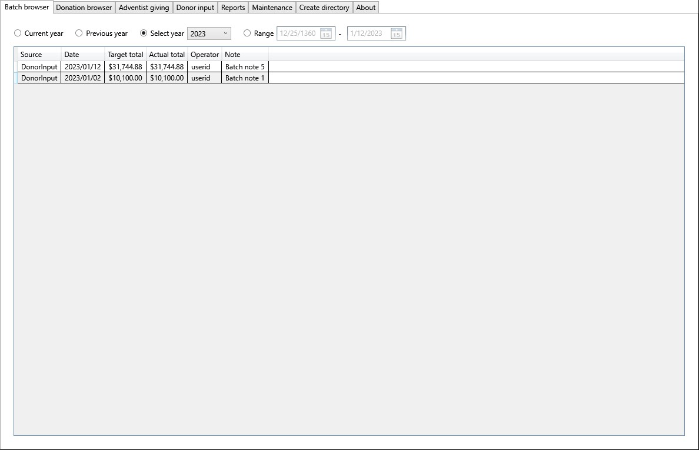

This is the default tab and is always the first to show when the application is launched.
By default the filter shows the current year.

All donations are entered in batches, either manually from tithe envelopes, or semi-automatically from an Adventist Giving csv report.
A batch retains all the details including all donors and the amount each donor contributed to different categories.
Double-clicking on a batch in the view will open up a popup window what show the details of the batch.

### Batch review popup

#### By category


The view shown above displays the subtotals for all the categories contributed to in this particular batch.
Double-clicking on a row in this view will pop up another window that shows the donors who contributed to the subtotal shown.

##### Batch contributions popup
Double-clicking on a contribution subtotal will pop up the following window which shows the donors who contributed to that category.


##### Batch contributions printout
Clicking the Print button will pop up the following window which shows a print preview of the same content, and an actual print button.


#### By donor


This subtab shows the same interface that is used to manually enter donations.
The table on the right side shows the donors who contributed to this batch and the amounts each gave.
Clicking on a row in that table will show the breackdown of what that donor gave to.
Changes can be made and saved to the batch.

#### Print
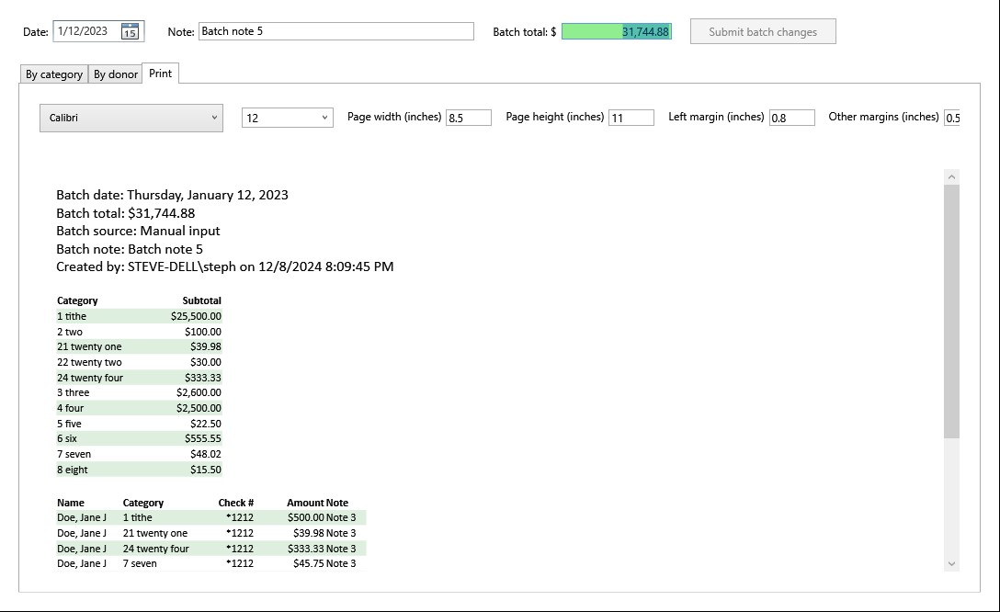

This tab provides a printable view of the batch that can actually be printed to paper.
The same content can also be printed to a pdf file using the Microsft Pdf print driver.
This printout shows the details of both the category and donor tabs.

### Donation browser


This tab is similar to the batch browser, except that instaed of showing batches to choose from, you can double-click on a category or a particular donation entry.
The categories and donations shown in the two tables are filterd by the date window options at the top, without regard to the batch they were entered in.
If there are many categories or donations, you can filter them to find a particular one of either.
Simply type the desired filter text in the text box under the label Filter:
For the donations, you must specify which fields to look in for the filter text.

#### Donor contributions popup

Double-clicking on a contribution subtotal will pop up the following window which shows the donors who contributed to that category.


#### Donor contributions printout

Clicking the Print button will pop up the following window which shows a print preview of the same content, and an actual print button.


#### Donation popup view

Double-clicking on the Donations on the right side of the donation browser will pop up a window with the other contributions made by that donor at the same time.
If it was an adventist giving donation, the other contributions with the same transaction id will be included.
If it was a tithe envelope donation, the other contributions included in the same envelope will be included.


### Adventist giving
For churches who receive most of their giving through this mechanism, the method of data entry will eventually become extremely efficient and easy to use.
The green box is for you to enter the total amount given in this batch.
The batch note is optional but does show in a column in the batch viewer list.
Click the button to browse and select the Adventist Giving csv on your computer.

#### Donor resolution


Because anyone can sign up for adventist giving, there may be times when someone gives through the system and they are not in your database as a donor.
Or it is possible that some detail of the donor as provided by the Adventist Giving report is different from the data your database.
In this case, you can decide to either update the fields that are different, or create a mapping, so that the next time that Adventist Giving donor gives, the will be automatically associated with the intended donor in your database.
As you might imagine, after doing this a few times and updating your database, or creating mappings, the Adventist Giving data entry can go very fast.

#### Category resolution


Just as there can be discrepancies between donors from Adventist Giving and donors in your database, the same can be the case for categories.
Sometimes the category in your database may already exist under a different code, or slightly different name.
In this case, a mapping can be made and the next time a donation is given to that Adventist Giving category, it will atuomatically be mapped to the right internal category code.
In addition to creating mappings, the category and code can be added as a new category to your database.

#### Verify and submit


This tab show a list of the categories given to in this batch and the subtotal given to each.
Select a date for the batch, then click the "Sibmit batch" button.
If the computed batch total doesn't match the target total, the numbers will show with a red background in the batch browser view.

### Donor input
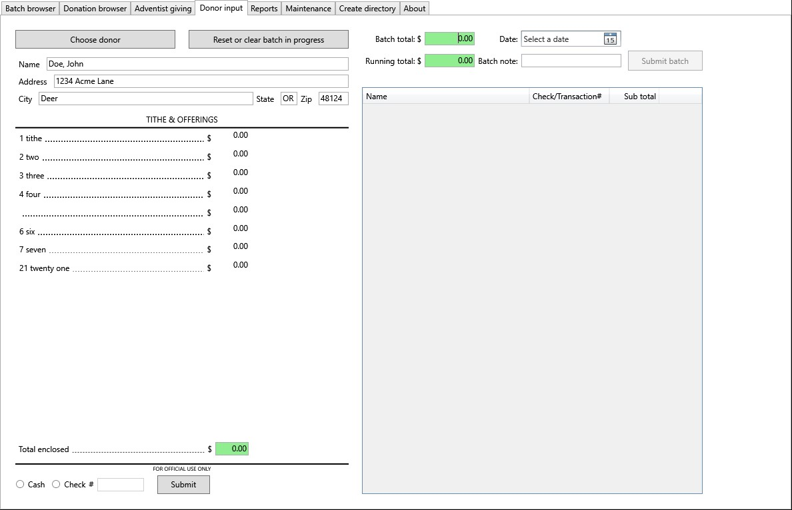

This tab is where you would manually enter donations collected on a given week.
At the top in green, enter the batch total, which should be the amount of money that was collected and deposited in the bank.
Specify the date for the batch, probably the day the donations were collected.
The table on the left is designed to look like a collection envelope where the donor can choose different designations for their contribution.

Select the donor by clicking on the "Choose donor" button or clicking ctrl-d.

#### Donor selection
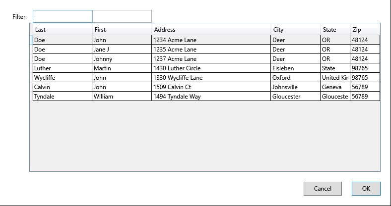

You can specify filters for first and last names independently.
When you see the donor you are looking for, double-click on it or select and "Enter" or click the "OK" button.
That should automatically fil in the name/address fields in the upper left corner.

Next enter the donation amounts for each category.
The amount on money will be allocated to the category specified on the left side.
You can change or add new categories by clicking on the space where the category and the ........ are.
Doing so will pop up the following dialog where the categories can be filtered by code or description, and selcted.

#### Category selection


When the donations for a given donor match up with the total specified on the envelope, specify Cash or Check, then click the "Submit" button, or ctrl-s.
After submitting a donor, their name and the total amount of their donations will appear on the right side of the page.
You can click on their name to bring up a popup version of this page to make changes to the details of their donation.

When all donation are entered, the Running total int he green box should match the Batch total just above it.
Clicking "Submit batch" or ctrl-a will close out the batch and post it to the batch browser view.

### Reports


This report tab differs from the batch report discussed already.
This report is generated for a given donor over the specified time frame.
The text box in the upper left is the merge template for the report/letter.
Various merge field variables are available to insert their giving data.
The {*table}, {*row}, {*col} fields allow for a table whose primary purpose would be columns.
In this case the church logo would appear on the left and the church address to the right of the logo.
The spacing of the from/to addresses can be designed to work in a window envelope.

The most common filter option will be to produce a report for a given year.

#### Letter template

The template is the way to design your report, including text, spacing, placement of data, and even formatting text into a table format.
The following are either commands or data insertion placeholders.

* \{Start table\}
* \{End table\}
* \{Start row\}
* \{End row\}
* \{Start column\}
* \{End column\}
* \{Church logo\}
* \{Donor name\}
* \{Donor address\}
* \{Date range\}
* \{Tax-deductible details\}
* \{Tax-deductible summary\}
* \{Tax-deductible total\}
* \{Non-deductible details\}
* \{Non-deductible summary\}
* \{Non-deductible total\}
* \{Contains deductible (condition)\}

The following template produced the letter in the screenshot shown above.
It is an example of a letter which could be tri-folded with to/from addresses visible in an window envelope.

```
\{beg_table\}
\{beg_row\}
\{beg_col\}
\{ChurchLogo Height=50\}
\{end_col\}
\{beg_col\}
Your church address
\{end_col\}
\{end_row\}
\{end_table\}


\{DonorName\}
\{DonorAddress\}


Dear \{DonorName\},

This document reports your remitted tax-deductible donations for \{DateRange\} and any other non-deductible items remitted. Please verify donations with your personal records and contact the Church Treasury if you discover variances.

Giving period: \{DateRange\}

\{TaxDeductibleDetails\}
\{TaxDeductibleSummary\}
Tax-deductible total: \{TaxDeductibleTotal\}* No tax deductible donations were given.

\{ContainsDeductible\}No Goods or services were received in exchange for these gifts.
\{NonDeductibleDetails\}
\{NonDeductibleSummary\}
Non-deductible total: \{NonDeductibleTotal\}

Thank you for your continued support,

Your Church Treasurer
```

#### Individual
If you are just generating a report for one person, click on the white box to the right of the Individual radio button.
The name of the donor who is chosen will appear in the box.
At that point, a preview of the report will automatically appear on the right side of the window.
You can just look at it, or print it to paper or pdf.

#### All pdf's
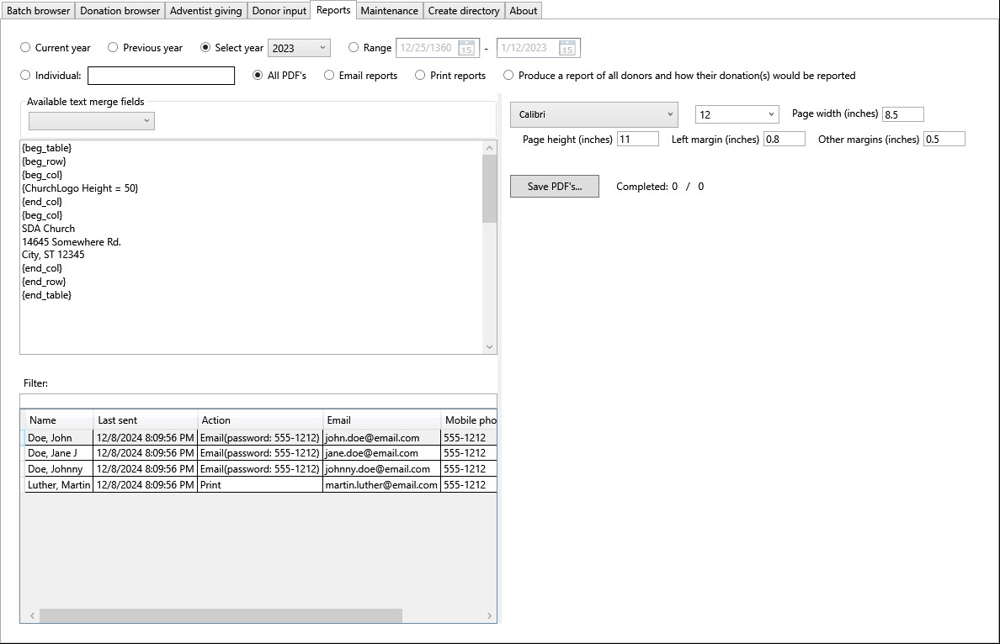

This option will generate reports as pdf's for all donors in the specified filter window.

#### Email reports
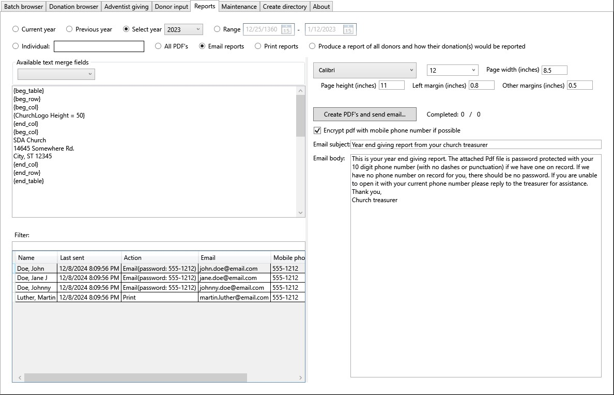

This option will generate reports as pdf's and email them to donor's that you have email addresses for.
There is an option to not email the report even it an email address is available for people who have technical difficulties receivein their report this way.
If the email option is selected an no password has been specified for the email sender account, a dialog will prompt for the password before this step can continue.


You can choose whether you want the password to be saved (encrypted) locally or not.
If not you would have to re-enter the password each time you perform this operation.

#### Printed reports
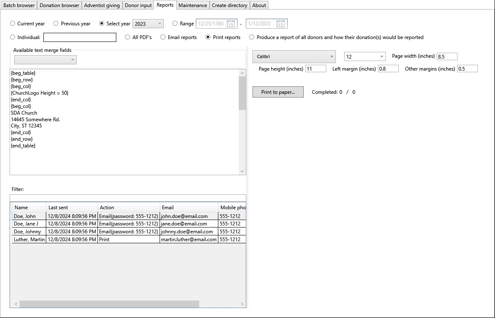

This option will generate and print paper reports for people that you do not have an email address for,
or those who the option is check to not send it by email.
The letter can be formatted so the address is visible in a window envelope.

#### Mock run
 would be reported")

This option if useful before sending out the year end donor reports to know how many cannot be sent by email.
This assumes that sending by email will be preferable to save paper and postage.
The reason's that the reports cannot be sent by email are:
- Not having an email address on record for the donor
- Having the DontSendEmail option checked for that donor.

The action button will essentially perform a dry run of the print option, and display the donor's that would have received a printed copy of their report.
The names along with the DontSendEmail option will be displayed in the table on the right side.
If you want to send the reports as email to those individuals, add email addresses to their donor records, and make sure the DontSendEmail is not checked.

### Maintenance

#### Donor
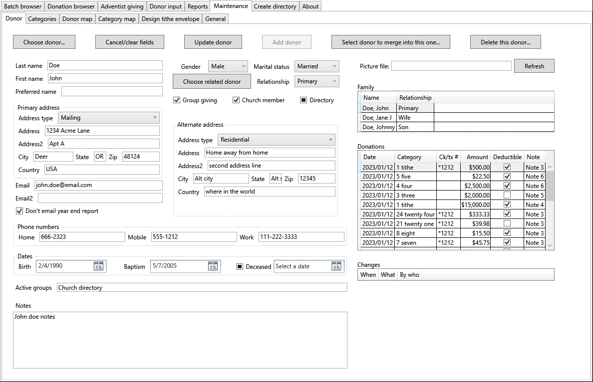

This tab is where donor records are edited, or new donors added.

##### Edit donor
Click "Choose donor" or ctrl-d to select a donor to edit.


After making the needed changes, click "Update donor" or ctrl-u, and the fields will be cleared.

##### Add donor
Fill out the fields and then click "Add donor" or ctrl-a.

##### Required/optional fields
In general, name either address or email address would be required.
That would allow for a way to send the giving report to the donor.
The address type should be "Residential & Mailing" in order to use as the destination for the giving report.
The "Related donors," "Group giving," and "Relationship," options are used to allow giving from multiple family members to the compiled into a single report, sent to the "Primary" family member.
This is especially useful for spouses who file jointly but may give individually at times.
Family members will show up in the table with column headings Name and Relationship.
You can click on a family member to popup the same user interface to view or edit the family member.
The way pictures are done is to simply specify a picture file name which will be appended to a base URL where the pictures are hosted.
(Pictures are optional)
The table below the family members will be a list of all donations given by all designated family members.

##### Merge donors
It would probably be a rare occurrence but if you somehow inadvertently ended up with two records for the same person,
with donations assiated with each, there is a way to merge the two donors into a single record, consolidating the donations as well.
Merge action will be confirmed with the following dialog prompt.


##### View family member
If the selected donor has family associated with them in the database, they will be shown in the list on the right under the picture field.
If a family member is double-clicked on, it will popup a donor view just like the current one.
On that popup view, changes can be made in the same way changes are made in the current view.

###### Donor popup view

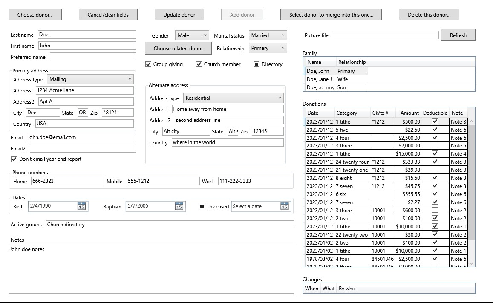

This view is the same as the Maintenance Tab's Donor view, except that it is in a popup window, allowing multiple instances so different donors can be edited at the same time.

#### Donations
On the right side of the donor maintenance view between the family members and donor changes lists is a view of all donations made by this donor's family giving group.

#### Donor changes
Again on the right side at the bottom is a view of changes made to the donor record, when they occurred and who made the changes.
If no changes have been made since the record was entered, the list will be empty.

#### Categories


This tab allows you to add or edit category codes and descriptions.
It functions very much like a spreadsheet, and supports deleting and inserting lines through a right-click context sensetive menu.
Changes made here are not written to the database until the "Save changes" button is clicked.
If changes are made but not saved, they can be reverted, bringing the list shown back in sync with the database.

#### Donor map


This tab allows you to see the donor mappings that have been created during Adventist Giving imports.
The Adventist Giving contact info are under the columns prefixed with AG, and the other columns are what is contained in your local database.
The yellow highlights make it easier to see the differences.
The right-click menu only supports delete because new mappings are only inserted during and Adventist Giving import.
Nothing will automatically delete mappings, so a manual delete option is available through the right-click menu.
If you happen to see a mapping with no yellow highlights, that means that the contact info is in sync and the mapping can be deleted.

#### Category map


This tab allows you to see the category mappings that have been created during Adventist Giving imports.
The Adventist Giving categories are under the columns prefixed with AG, and the other columns are what is contained in your local database.
The yellow highlights make it easier to see the differences.
The right-click menu only supports delete because new mappings are only inserted during and Adventist Giving import.
Nothing will automatically delete mappings, so a manual delete option is available through the right-click menu.
If you happen to see a mapping with no yellow highlights, that means that the category info is in sync and the mapping can be deleted.

#### Design tithe envelope
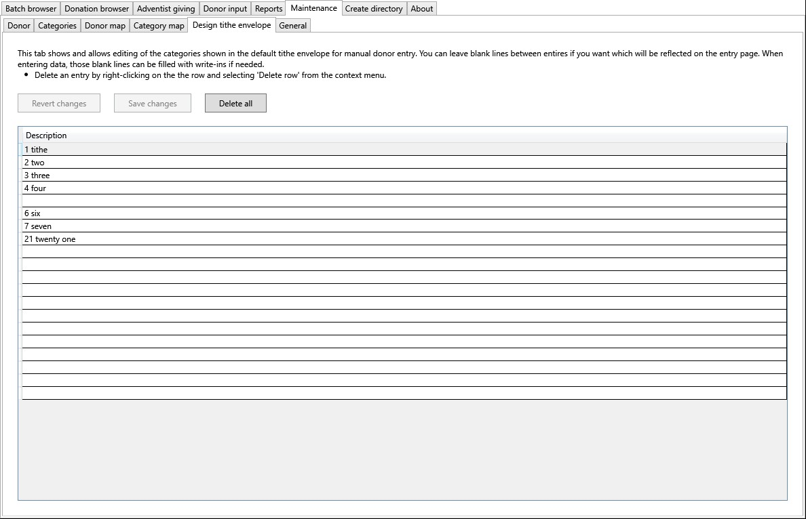

This tab will affect the donor entry view.
Each church or organization may have different categories and even a different order of the same categories on their donation envelopes.
This maintenance tab allows you to make the data entry screen look very similar to the physical envelope, thus making it easier to enter the donation amounts for each category.
As with many of the other maintenance tabs, changes made are not automatically written to the database, and must be save by clicking the "Save..." button.

#### General


This maintenance tab is an assortment of options and even some functionality.

##### Organization logo

This is a graphical image, probably jpg or png, of the organization's logo.
This can be printed on reports.

##### Export to csv

This functionality will probably not be used much, but if you happen to want to export Catgories, Donors, or Donations to a csv file, this is where you can do that.

##### App settings

###### SyncFusion licence key

Syncfusion is a company that offers a wide variety of libraries to aid in software development.
In this case, the license is the for software used to create pdf files.
SyncFusion offers different levels of licences for different prices.
For the benefit of small businesses and non profits, they have a community level license that your organization will most likely qualify for.
Go to their website to apply for a license and when you get it, enter it here.
Once that license is in place, the pdf's generated will no longer have a watermark on them.

https://www.syncfusion.com/sales/communitylicense

##### Email settings

The Email settings are all in support of the feature to send out annual giving receipts via Email when possible.
The goal of this feature is to be able to create the receipt/report as a pdf and send it as an attachment by Email.
In other to do this without an Email client, the following settings which are similar to that used for setting up an Email client are needed.
This feature has been tested with a google account with an app password for authentication.
Gmail does not allow applications that are not email clients to authenticate with the usual google account password.
For this reason a couple google account settings changes may be required, followed by the creation of a google app password.
There is one other good reason to use a Gmail account for this, which is that some less known smtp servers get blocked for spam reasons.

###### Smtp server
This is the outgoing Email server, and will often have 'SMTP' somewhere in the name.
In theory the Email feature could work with any mail provider but it has only been verified with Gmail.
The Gmail server name is smtp.gmail.com.

###### Port
This will be the port through which to reach the smtp server.
This is configured by the mail provider and will be provided in their instructions for setting up your mail client.
Having said that, this code has only been tested with Gmail port 587.

###### Sender Email address
When sending the giving reports via email, a sender address/account is required.
This can and probably should be the address of the treasurer, or whatever address you might want to receive responses to.
Since the implementation for sending email messages is done with a gmail app password, the sender account should be hosted by gmail as well.

###### Email password
There are different ways that email can be sent from software applications, but in this case .NET provides some functions with some pretty standard parameters, including user account/password.
You can try using the settings that you use on your email client to configure your outgoing mail server.
This application has been tested with a Gmail account and app password in place of the usual password that would be entered when setting up the Email clint.
Since this project is open source, you are free to modify the code to send email however you would like, but if you would like to create a Gmail app password, they following steps might help.

* Log into the google account on a web browser.
* Click on the colored circle in the upper right which is an icon for the logged in user.
* From the droped down options, click "Manage your google account."
* In the navigation pane on the left side, click "Security."
* Then in the searchbar for the page, enter "App passwords" and you should see that as an option, click on it.
* Enter a descriptive name for the application (I don't think it needs to match this exe).
* Then generate an app password that can only be used by this application.

This Email password will be persisted locally only, unlike the other email settings which will be stored in the database.
In other words, other user's of the application sharing the same database, will see the same settings from this page except for the Email password.
Each computer running the software that needs to use that functionality will need to enter the Email account password themselves.
Having said that, this functionality is typically only used once a year and will probably be done by the head treasurer.

### Create directory

In the database, there is a Directory option that can be checked, unchecked, or unspecified.
This tab will first filter for donors which have the Directory option checked.
The progress bar at the bottom of this tab show that progress, and when it is complete, the results can be fed to either of the subtabs for further filtering.

#### Pdf file


The Pdf creation tab has a few options.

* Address - will determine whether the mailing address will be included in the Pdf directory
* Email - will determine whether the email address will be included in the Pdf directory
* Phone number - will determine whether the phone number will be included in the Pdf directory
* Include non-members -  in the database, there is a "Church "member" check box that can be checked, unchecked or unspecified.
The Pdf directory can be created with either option.

The progress of this subtab will be tracked with the upper progress bar, and when that completes, the "Save as Pdf..." button will be enabled.
This stage renders the cover and all the directory entries to a FlowDocument which can be pre-viewed on the right half of the screen.

The front cover of the document can be designed in the RichTextBox on the left side of the app.
It is a WYSYWYG editor and can contain images.
Image sizing is pretty limited, but when an image is added, it is automatically sized to fit between the margins.
If for some reason, the image overflows the margins, selecting or clicking on it should size it to fit.
If you want an image smaller than the full page width between margins, you can try making the image smaller.

You have the option to encrypt the Pdf file with a password to provide some security for people's contact information.

Finally, you have the option to specify the font, text size, as well as the page size for the generated Pdf.
The internal layout of the Pdf is not customizable, but since this is open source, you can modify to code any way you want.

#### Html file


This tab will render one or two Html pages, ordered by last or first name.
The options at the top of the page can be used to configure a few options.

* Include non-members - in the database, there is a member option that can be checked, unchecked or unspecified.
The Html directory can include either
* Pcture path - each donoe record can have a picture file name. There are file names that should be found in the picture path.
The path can be relative the the top level Html file, or it can be a fully specified http:// URL to which the picture file name will be appended.
* Order by last name - This option will usually be checked because that is how directories are usually ordered.
If checked the Html file name should be specified.
This file will be placed in the OutputFolder (see option).
* Optionally, a different Html file can be created with people ordered by first name.
In this case, a different file name should be specified.
If you want to link to either html file from the Header of Footer of the completed page, those links should reference the names specified here.
* OutputFolder - this is a local directory where the Html pages will be rendered.
You may have some folders of support file already in that folder such as css, style, js, pictures.
If you have all the necessary files for the Html pages to work, then the left side of the page will show a preview of the web page when it is complete.

This NOT is a server rendered web page constructed on the fly from the data base entries.
It is a static web page rendered in its entireity.

### About
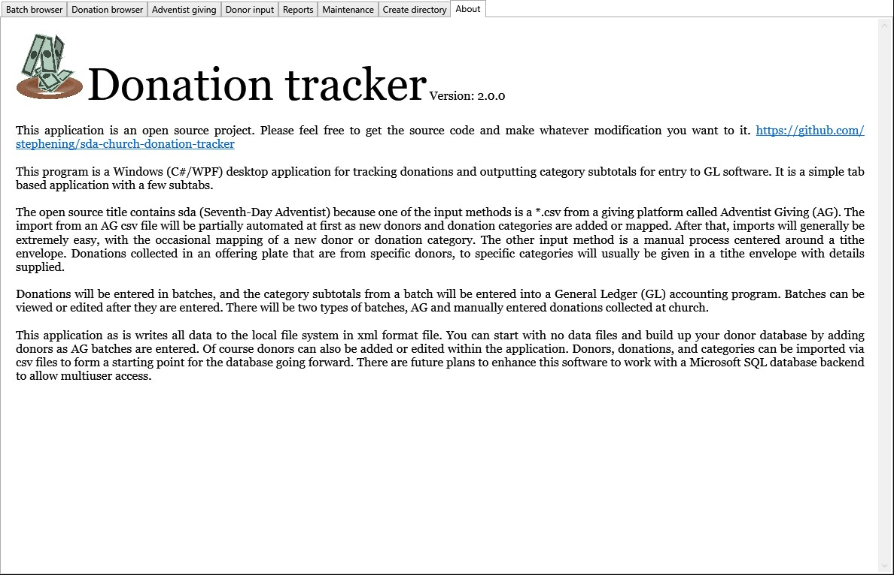

## Database setup wizard

### Database wizard introduction


Without access to a backend SQL database, the main application is not very useful.
The purpose of the database setup wizard is to help new users with the database setup process.
For this reason, the wizard is the first application that should be run.
The wizard must run with elevated priviledges like the installer, so on launch, you should expect and approve the request to run with elevated priviledges.
The first page is just some introductory text, explaining what the purpose for the wizard, and what it aims to do for you.

### Choose how your database will be configured


The second page of the wizard will affect some of the following steps taken.
There are three options to choose from.

#### I already have a database and connection string

This will usually be the case if someone is already using the software and you are just installing it on another computer.
The donation tracker software can be installed on multiple systems and all share the same database.
You can either ask the database administrator for the connection string, or have another user of the software look in the Donation-tracker.dll.config file in their installed application folder.

#### Set up an SQL database on a server on accessible over the Internet
If the software is not currently in use yet for your organization, and you wish to be able to have multiple people using it, sharing the same database, this is the option to choose.
There are many ways this can be done, but it will probably require the expertise of a person knowledgeable about servers or cloud based systems.
The server can be a physical system, or it can be a virtual system on a cloud service such as Azure or AWS.
The database will be Microsoft's SQL server, which can be installed on a Windows or Linux system.
Once a server is available, the installation of the SQL software is not difficult.
Some port mapping may be needed and and user account/password may be needed.
The expertise and knowledge of an IT professional may be needed to understand the security issues.

#### Set up an SQL server on the same computer the application will run on
If the software is not currently in use yet for your organization, but since you have a small organization, you will only need one computer accessing the data.
In this case, the SQL server can be installed on the same computer that the software is run on.
This is pretty straight forward and the wizard will step you through the process.

### Connection string for access to the SQL database


If you only need to supply the connection string because your database is already setup, this is the page you will see.
The provided default value should is what it will most likely look like for a local database install.
If your database is already set up on a server, your connection string will be different.
It may look something like this:

Server=&lt;server&gt;,&lt;port&gt;;Database=donations;User ID=sa;Password=&lt;password&gt;;Encrypt=True;TrustServerCertificate=True;Connection Timeout=30;

The string is a set of key value pairs separated by semicolons.
Lets take a look at the elements in this example.

* Server - this is required and should be a domain name or IP address.
The port value is optional if the default SQL port will be used to access the server, but it will most likely be required.
* Database - this is required and will most likely be donations.
For advanced users, one might use a program like Microsoft SQL Server Management Studio, to change the name of the database.
In this case, then one might use that name for the database.
* User ID - depending on how the database is secured, there will possibly be user/password authentication.
This would be setup by the database administrator.
* Password - this will go along with the username if the SQL server was setup with username/password authentication.
* Encrypt - will probably be set to True.
* TrustServerCertificate - will probably be set to True, unless the server is self hosted and self signed.
In which case the certificate would not be verifiable, and you should set this to False so the certificate verification step will be skipped.
* Connection Timeout - this parameter can be set to 30 (seconds).
Essentially what this does is specify the connection timeout if you are unable to connect to the server with the connection string supplied.

Given the connection string supplied, click the button so see if a successful connection can be made.
If a connection is not successfully established, verify again that it is the same on the working system.
If it is, you may need some help from the server administrator to see if the incoming connection is being blocked.
You can also try connecting with Microsoft SQL Server Management Studio, but rather than take a single connection string, parameters are broken out into serveral fields.
Not all of the options discussed above will be available.

### Suggested steps for installing SQL on a server


If you had selected the second radio button, this is the page you would have landed on after clicking Next.
These are merely suggestions of some steps for installing the SQL server.
If you are not qualified to setup and configure cloud based systems, you should really get some help from an IT professional.

Upon clicking Next from this page you should land on the [SQL connection string](#SQL-connection-string) page.

### Suggested steps for installing SQL on the local system


If you had selected the third radio button, this is the page you would have landed on after clicking Next.
The steps for installing MS SQL server on the local system are pretty simple and straight forward.
Click on the hyperlink to download the installer from Microsoft.
Then perform a basic install, going with default options.
The connection string shown at the end of the install is the default supplied on the next page so you don't even have to copy it.

Upon clicking Next from this page you should land on the [SQL connection string](#SQL-connection-string) page.

### Create the database and tables


After successfully connecting with the server, the database and tables will need to be created.
If you have just connected with a new connection string and have not created the database yet, click the button "Create database."
The status, success or failure should be indicated in the text box under the two buttons.
After that, the database is still useless without the tables.
Next click the "Create tables" button.
Both of these actions are safe to click if you already have a database and tables.
They will not delete what you have.

Upon clicking Next from this page you should land on the [SQL connection string](#SQL-connection-string) page.

### Specify a logo file for your organization


This step is completely optional, unless you wish to include your organization's logo on reports you print.
You can skip this step in the wizard and add your logo later in the Maintenance section of the main application.

### Import donation categories
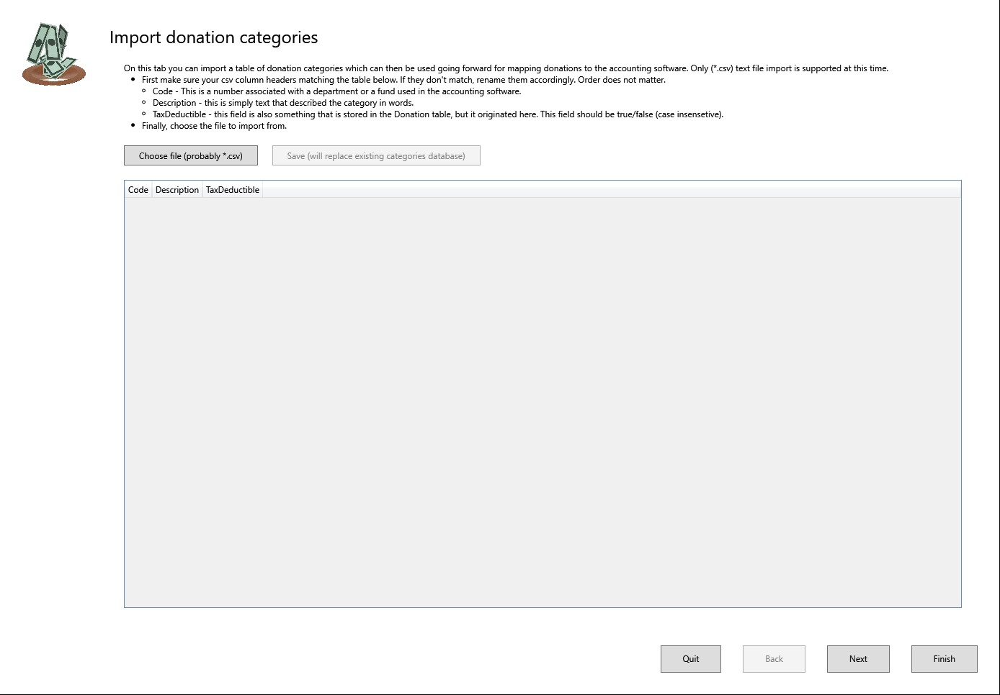

Accountants will usually have different funds or categories, each with their own balance.
Money will be donated and designated for certain categories, and expenses will be paid out of certain categories.
These fund's or categories are usually identifed by a numeric code, and a word desription.

This page can be skipped if you do not have a csv of existing categories to import.
However, if you are converting from another accounting software package and wish have some sort of continuation, you should try to export your current categories so they can be imported here.

You can skip this page now and then come back an re-run the wizard again to perform an import.
The import functionality is not available in the main application.
This action will completely overwrite any categories currently in the database, so you will typically only perform an import after just creating your database and tables.

### Import donors


Tracking donor's is essential for tax-exempt organizations primarily because receipts must be provided to donors for tax filing purposes.
More than just the name is needed in order to provide a receipt at the end of the year.
The donation tracking application actually exposes many more fields than are needed for tracking donations, but the most important are the full name and an address or email address.
There are provisions for combining giving from different members of the family into one giving report.

This page can be skipped if you do not have a csv of existing donors to import.
However, if you are converting from another accounting software package and wish have some sort of continuation, you should try to export your current donors so they can be imported here.

You can skip this page now and then come back an re-run the wizard again to perform an import.
The import functionality is not available in the main application.
This action will completely overwrite any donors currently in the database, so you will typically only perform an import after just creating your database and tables.

### Import donations


If making the transition to the new software at the turn of the year, it is not necessary to import and historical donations.
On the other hand if there are questions that arise regarding the previous year, it is nice to have easy access to the data.

This page can be skipped if you do not have a csv of existing donations to import.
However, if you are converting from another accounting software package and wish have some sort of history, you should try to export your current donors so they can be imported here.

You can skip this page now and then come back an re-run the wizard again to perform an import.
The import functionality is not available in the main application.
This action will completely overwrite any donations currently in the database, so you will typically only perform an import after just creating your database and tables.

### Finished


You have completed the wizard steps.
You can run the wizard again if needed.

# Markdown to html

This is a small tool which converts the README.md file into an application html help file.
A help viewer is available by pressing F1 when the application is running.
The viewer window that pops up has a navigation pane showing the help contents.
When F1 is pressed, the application will attempt to jump to the relevant content in the help file.

This tool is a headless application that takes the markdown source file as a parameter.
Assumptions are that the output will be three files written to a "Help" folder.
The README.md file in the root folder references screenshots in the relative folder ./Documentation/screens.
The html file produced is modified to look for the screenshots in the same folder.

File written by this tool are:

* Help\Help.html - Help file which can be double-clicked on to view in a browser, but will be presented from the application in a help viewer popup window.
* Help\NavTree.json - This file is deserialized into the HelpViewModel (ObservableCollection<HelpNavigationViewModel> HelpNavigation property).
This property can be directly linked as the ItemsSource for the help content TreeView.
The click handler for the TreeView object will jump to the corresponding content in the Help.html file.
* Help\NavAnchors.json - This file is deserialized into the the HelpViewModel (Dictionary<string,string> Anchors property).
This dictionary has navigation anchor id's as the keys, and header text as the values corresponding to the help file content to show for context sensetive help.